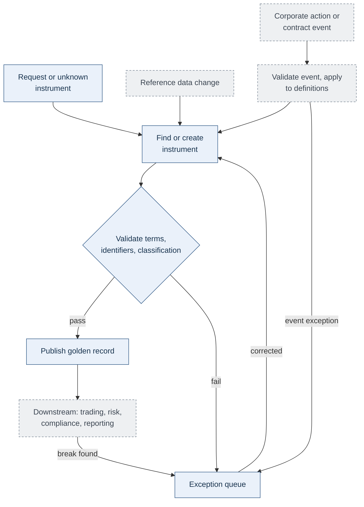
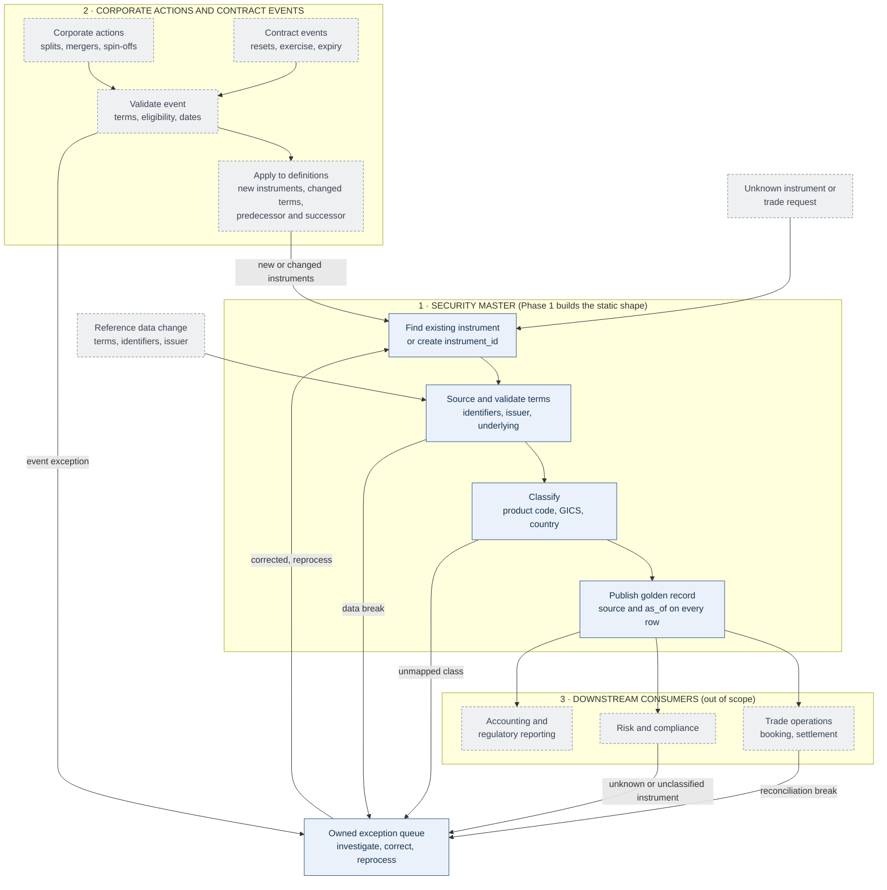
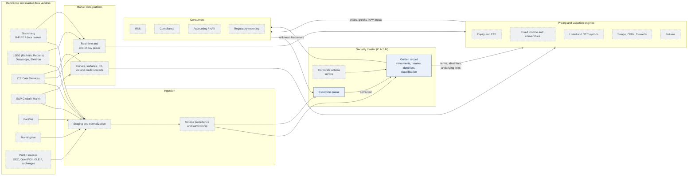

# Security Master Operations Flow

> Index: [README.md](../../README.md) · Scope: [Project scope](1_3-project-scope.md) · Schema: [Database schema](3_1-database-schema.md)

How a security master sits inside a fund's operations. **Phase 1 is a static, one-time load**
([Project scope](1_3-project-scope.md)): it builds the golden record once and does not operate on it. This
page describes the operating model around it. Blue boxes in the diagrams are built in Phase 1; grey are not.
"Security creation" means creating the instrument's record in the master, not issuing a security.

## Problems a security master solves

| Problem | Without a master | With C.A.S.M |
|---|---|---|
| Product classification | Each desk labels the same instrument differently (a SPAC warrant as "equity", "option" or "other") | One product code per instrument from one taxonomy, chosen by table-driven rules |
| One view of holdings | One security under several internal IDs splits and understates exposure | One instrument and issuer identity with all identifiers mapped; positions (outside the master) join on it |
| Alignment across teams | Each team keeps its own reference data; breaks become disputes about definitions | One taxonomy and identifier model every team reads |
| Regulatory reporting | Classification rebuilt per report | ISDA, CFTC, MiFID II / EMIR attributes on the product code, so "what is in scope" is a query |

Phase 1 demonstrates the first, third and fourth on the 13F sample and shows the identity model behind the second.

## 1. Overview

Corporate actions and contract events change an instrument's definition only where appropriate (a spin-off
creates a security, an amendment changes terms). Routine payments affect cashflows, not the master.

## 2. What is managed, and what C.A.S.M holds

| Record | Represents | Phase 1 |
|---|---|---|
| Instrument master | Terms, share class, strike, expiry, underlying links | Yes: `sec_instrument` plus subtype tables |
| Entity master | Who issues or guarantees | Yes: `sec_issuer` |
| Reference data | Identifiers, countries, classifications | Yes: `sec_identifier_xref`, `ref_*` tables |
| Corporate action | Dividend, split, merger, spin-off, rights issue | No |
| Market data | Prices, FX rates, curves | No |

**Correcting a bond's coupon definition is a reference data change; recording its coupon payment is an
accounting event.** C.A.S.M owns only the first.

## 3. Security creation and setup

Triggers: a manager wants something never held; an execution arrives with an unknown identifier; a corporate
action creates an instrument; a new OTC contract needs terms recorded.
**Request → search and deduplicate → source terms → validate → classify → approve → publish.**

| Step | In C.A.S.M |
|---|---|
| Search and deduplicate | Match on identifier, never ticker or description alone; `sec_identifier_xref` is unique on `(scheme, value)` (R6) |
| Internal ID | `sec_instrument.instrument_id`; CUSIP, ISIN, share-class FIGI in `sec_identifier_xref`; venue symbol and FIGI on `sec_listing`. Identifier levels differ and must not be merged |
| Source terms | Filing, then public sources, else null with a source ([Project scope](1_3-project-scope.md) section 8) |
| Validate | Rules R1 to R10 ([Project scope](1_3-project-scope.md) section 7.3): completeness and economic consistency |
| Classify | One product code plus an issuer-level GICS sub-industry |
| Approve and publish | Phase 1: every passing row is the golden record; no approval step |

| Product | Critical fields | Table |
|---|---|---|
| Equity | Share class, issuer, currency | `sec_instrument_eq_spt` |
| Convertible bond | Coupon, maturity, conversion ratio, underlying | `sec_instrument_fi_bond` |
| Warrant, right, unit | Underlying, exercise price and ratio, expiry | `sec_instrument_eq_warrant_right` |
| Fund | Structure, leverage, tracked index | `sec_instrument_fnd` |
| Future | Underlying, multiplier, expiry, settlement | `sec_instrument_fut_contract` |
| Option | Underlying, put/call, strike, expiry, exercise style | `sec_instrument_opt_series` |
| Forward, CFD | Underlying, settlement, maturity | `sec_instrument_fwd_contract` |
| Swap | Underlying, legs, termination | `sec_instrument_swp_contract`, `_swp_leg` |

A wrong option multiplier distorts exposure; a wrong day count breaks accruals. Validation checks economic
consistency, not only presence. An operating master would add readiness states (trade, settle, value, report)
and owned provisional setups; Phase 1 has none.

## 4. Classification

Classification decides the booking workflow, valuation model, expected lifecycle events, risk factors, and
compliance and reporting rules.

| Classification | Purpose | Phase 1 |
|---|---|---|
| Product structure | Stock, convertible, future, option, swap | Product code ([Taxonomy](2_2-taxonomy.md)) |
| Economic exposure | Asset class, issuer, sector, geography | Asset class; issuer GICS sub-industry and country |
| Processing | Listed or OTC, cleared, cash or physical | Partly: venue per listing (OTC derived), settlement type on contract tables; no clearing |
| Regulatory | Report-specific categories | `cftc_asset_class`, `mifid_category` on derivative product codes; CFI, UPI not held |
| Fund-specific tags | Strategy, sleeve, mandate | Not in the master (trade or position level) |

A total return swap has swap structure, equity exposure through its underlying and counterparty exposure to the
dealer; the views coexist. Risk and compliance own their interpretation rules; the master ensures mappings are
populated and exceptions resolved.

## 5. Corporate actions and lifecycle events

**Receive announcement → validate terms → identify affected instruments → apply to definitions → publish →
notify downstream.** Entitlements, elections and cash or share movements are position work, outside the master.

On an event the master must: create instruments, issuers and identifiers (spin-off, merger, rights issue);
record predecessor and successor links; change terms and identifiers with effective dates, keeping old values;
retire instruments (maturity, expiry, redemption, delisting). A spin-off, for instance, creates SpinCo as an
issuer with instrument, identifiers and classification, linked to ParentCo; operations, accounting, risk,
compliance and custody all react.

### 5.1 How corporate actions hit instruments already in the master

| Corporate action | Existing instruments | What it disturbs in the Phase 1 design |
|---|---|---|
| Cash dividend | Unchanged | Nothing (dividend dates are event data, not held) |
| Name or ticker change | Same instrument; identifiers change | `sec_identifier_xref` is unique on `(scheme, value)` with no validity dates: old and new cannot coexist and a reused CUSIP collides; tickers on listings have no dates either |
| Split or reverse split | Same instrument; identifiers often change | Dependents must adjust: `conversion_ratio`, `exercise_price`, `exercise_ratio`, option `strike` and `contract_multiplier`, future multiplier |
| Spin-off | Parent unchanged; options, warrants, convertibles adjusted; new issuer and instrument | Adjusted options may deliver both companies' shares, but `sec_instrument_opt_series` has one underlying and a `NOT NULL` strike |
| Merger or acquisition | Target retired; instruments move to the successor or are cashed out | Underlying foreign keys dangle; `issuer_id` must move; R4's same-issuer expectation breaks |
| SPAC business combination | Shares become operating-company shares; rights convert; units separate or lapse; warrants continue | `issuer_type` changes from `SPAC`; GICS and country change; warrants point at a changed underlying |
| Rights issue | Underlying unchanged; new `EQ-SPT-RIGHTS` with expiry | Rights must link to the underlying and later expire or convert |
| Conversion, exercise, redemption | Convertible, warrant or right retired | No instrument status in the schema, while dependents may still point at it |
| Delisting, bankruptcy | Instrument stays, often with new identifiers and venue | `sec_listing` has no status or validity dates |
| ADR ratio change or programme end | Receipt stays or is retired | No ratio held; the underlying link is an issuer and a flag |

Challenges this raises:

- **Identity versus identifier.** `instrument_id` is stable but identifiers change; without effective dates the
  master cannot hold both or answer "what was this on a past date".
- **Terms change in place.** Adjusting a ratio or strike overwrites the row and loses the before state; adjusted
  options are often new non-standard series.
- **Dependent instruments.** When an underlying is retired or replaced, every convertible, warrant, right, option,
  future and swap on it must be re-pointed, adjusted or terminated together; some no longer fit.
- **Change of class.** A right becomes shares, a preferred converts, a warrant is exercised. Subtype rows are tied to
  the product code by composite key, so it cannot simply be edited: a new instrument with a successor link, or a
  migrated subtype row, either needs a rule.
- **Issuer moves.** A merger reassigns instruments to an issuer with its own country and classification, changing
  inherited attributes for all of them at once.
- **Retire, do not delete.** Deleting breaks foreign keys and lineage; it needs a status and end date, and old
  identifiers must still resolve.
- **Predecessor and successor links are many-to-many** (merger: two into one; spin-off: one into two); there is no
  link table.
- **Timing and quality.** Announced, amended, cancelled and effective dates differ; when-issued instruments later get
  real identifiers; sources disagree, so field-level precedence and approval are needed (section 6).

Contract events: swaps (financing accruals, resets, underlying adjustments), options (exercise, assignment,
expiry), futures (variation margin, expiry, settlement), convertibles (conversion, call, put, redemption),
warrants and rights (exercise, expiry, unit separation). Keep each event's **before and after state, effective
time, source and approval history**. Phase 1 has no event table, predecessor/successor link, instrument status
or effective dating; it reflects earlier events only implicitly (a SPAC's units, shares, rights and warrants are
separate instruments under one issuer).

## 6. Ongoing reference data management

Teams watch identifier changes, issuer reorganizations, revised terms, classification changes and vendor
corrections. A controlled process needs field-level source rules, validation of missing or implausible values,
effective dating (valid time and when the fund learned it), approval and override history, distribution
monitoring, and impact analysis. Propagation is the hard part: fixing the master does not fix a booked cashflow,
a cached risk figure or a submitted report. Phase 1 has only per-row `source` and `as_of` (R10); the rest is the
Phase 2 list in [Project scope](1_3-project-scope.md) section 13.

## 7. Consumers of the master

| Function | Needs from the master | Also needs (not in the master) |
|---|---|---|
| Investment compliance | Issuer links, classifications, underlying links | Holdings, proposed trades, restrictions, mandate rules |
| Market risk | Terms, underlying links, asset class | Positions, market data, models |
| Counterparty risk | Legal entities, contract terms | Trades, valuations, collateral, netting |
| Regulatory reporting | Product codes, regulatory categories, entities | Report scope, positions, transactions |
| Accounting / NAV | Terms, conventions, identifiers | Trades, prices, accruals, fees |

**The master alone cannot produce a risk or compliance report.** Reporting must not silently omit an instrument
that failed classification or validation: it sits in the owned exception queue.

## 8. Ownership

| Role | Owns |
|---|---|
| Portfolio manager / trader | Intended economics, elections |
| Reference data | Instrument definitions, identifiers, relationships, data quality, the exception queue |
| Trade operations | Booking, matching, settlement, reconciliation |
| Corporate actions | Event validation, entitlement, outcome tracking |
| Risk | Models, exposure interpretation, limits |
| Compliance / reporting | Rule interpretation, regulatory mappings, filings |
| Technology | Integration, distribution, lineage, monitoring |

**Operational test:** trace a reported exposure back through classification, terms, position, trades and events,
with a named owner for any break. The master's part: instrument → `sec_identifier_xref` → product code and
taxonomy attributes → subtype terms → issuer (country, GICS) → `source` and `as_of`. Gap: a mapped instrument does
not record its filing row number; only queued rows keep file hash and row number.

## 9. Detailed flow

**Solid arrows** are processing and data flow. The exception queue exists in Phase 1 as a table
filled during the one-time load; its return path to `IDENTIFY` (correct and reprocess) is the
operating model. Across every component: source lineage, effective dating, approval history,
access control and a named owner.

## 10. Surrounding systems (Phase 2+)

None of these systems exist in Phase 1, which reads pinned public files only
([Data sources](2_0-data-sources.md)). They show where the master sits in a full estate. The master
stays reference data; vendor feeds supply it with identity and terms, and pricing engines consume it.

Solid fill is built in Phase 1 (the golden record and exception queue as a static load); dashed is
not built. Vendor-to-system mappings in the diagram are typical, not commitments: each vendor offers
several products, and which are licensed is a Phase 2 decision.

### 10.1 Vendors

| Vendor | Typical role | Feeds |
|---|---|---|
| Bloomberg | Real-time and reference data (B-PIPE, Data License); FIGI | Master and market data |
| LSEG (Refinitiv, Reuters) | Reference data, corporate actions, real-time and pricing | Master and market data |
| ICE Data Services | Evaluated bond prices, reference data, curves, real-time | Master and market data |
| S&P Global / Markit | Credit and CDS spreads, loan and bond data, indices | Market data, some reference |
| FactSet | Reference data, fundamentals, analytics | Master |
| Morningstar | Fund and ETF data, ratings | Master (funds) |
| Public sources | SEC, OpenFIGI, GLEIF, exchanges, ISO registries | Master (Phase 1 uses these only) |

### 10.2 Pricing engines by product

Pricing engines are separate systems that take instrument terms from the master and market inputs
from the market data platform. The master holds no prices or valuations.

| Product family | Terms from the master | Market inputs |
|---|---|---|
| Equity, ETF, ADR | Identifier, listing, share class | Last, close, FX |
| Fixed income | Coupon, maturity, day count, call schedule | Evaluated prices, yield and credit curves |
| Convertibles | Bond terms, conversion terms, underlying link | Underlying price, vol, credit spread, rates |
| Options | Underlying, strike, expiry, exercise style | Underlying price, vol surface, rates, dividends |
| Futures | Contract specification, expiry | Settlement and curve data |
| Swaps, CFDs, forwards | Reference asset, legs, terms | Underlying price, funding and swap curves |
| Warrants and rights | Underlying link, strike, ratio, expiry | Underlying price, vol |

### 10.3 Components

| Component | Role |
|---|---|
| Vendor ingestion | Staging, normalization, entitlement and licence control |
| Source precedence | Field-level rules deciding which vendor wins ([6](#6-ongoing-reference-data-management)) |
| Corporate actions service | Event validation and application to definitions ([5](#5-corporate-actions-and-lifecycle-events)) |
| Market data platform | Stores and serves prices, curves and surfaces |
| Pricing engines | Value each product family from terms plus market data |
| Distribution | Versioned data contracts, query API, change events |
