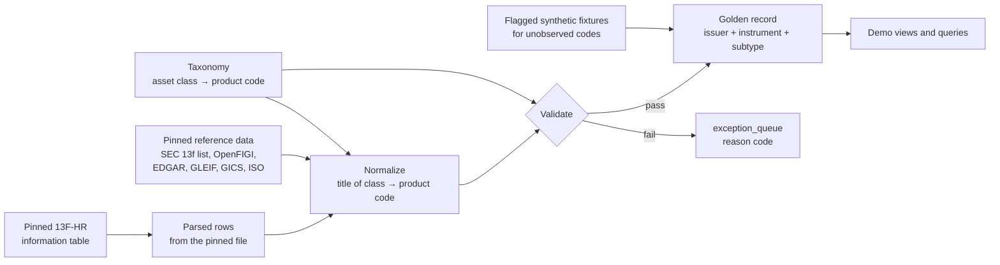

# Project Scope (Phase 1 Prototype)

> Owner: Mohit Choudhary · Index: [README.md](../../README.md)
> Forward-looking, with [Operations flow](1_1-sec-master-ops-flow.md). Every other page describes what exists.

## 1. Purpose

C.A.S.M is a time-boxed prototype that demonstrates its core architectural tenets on a small, realistic
cross-asset dataset. It is **not** a full security master. The Linden Advisors Form 13F-HR (filed 2026-08-14)
is used only as a publicly verifiable **sample list of instruments**, so the demo runs on real identifiers
and issuers rather than toy data.

### 1.1 What success looks like

One end-to-end demo shows that:

1. A taxonomy (asset class, then product code) is the spine of the model.
2. Issuers and instruments are separate, related only through foreign keys.
3. Relationships between instruments (convertible to underlying, warrant or right to issuer, option to
   underlying) are enforced by the database.
4. One identifier model serves every asset type.
5. Bad data is rejected or quarantined with a reason, never silently absorbed.
6. Every baseline row is mapped or held in the exception queue.

### 1.2 Non-goals

- Every asset class, or the full product-code taxonomy.
- **Reference data only:** no positions, quantities, values, exposure, risk, P&L or trade lifecycle.
- Reproducing Linden's OTC book (not public).
- Vendor licensing, SLAs, entitlements, or a user-facing production application.
- Bitemporal history, vendor survivorship, a change-event bus (section 13).

## 2. Baseline

| Attribute | Value |
|---|---|
| Source | SEC Form 13F-HR, LINDEN ADVISORS LP (CIK 0001279396) |
| Accession / dates | 0001193125-26-350767; filed 2026-08-14, period 2026-06-30 |
| Local file | `docs/references/linden-sec-filings/holdings/13F-HR-56990.xml` (638 `infoTable` rows) |

### 2.1 What the baseline can and cannot tell us

| Available | Not available |
|---|---|
| Issuer name, title of class (free text), CUSIP | Short positions, non-US-listed holdings |
| Put/Call flag (options appear as underlying plus flag only) | Option strike, expiry, exercise style |
| Amount type (`SH` / `PRN`) | Futures, CFDs, forwards, swaps (outside 13F scope) |
| | Company-level GICS; structured convertible terms |

Profile of the file (2026-09-30):

- `titleOfClass`: `RT` 261, `COM` 243, `SDBCV` 133, `ADR` 1. No `putCall` element appears.
- All 638 CUSIPs are distinct, in 402 issuer prefixes (first 6 characters). Some start with a letter (non-US).
- `RT` holds both SPAC rights (`... RTS`) and warrants (`... W EXP ...`, `... CW28`, `... WT`); many names carry no marker. One unit is filed under `COM`.
- Convertible names carry coupon, maturity and a `144A` marker. No convertible shares a prefix with a `COM` row, so the underlying common stock is not in the filing. 207 of 261 `RT` rows share a prefix with a `COM` row; 54 do not.

### 2.2 Baseline handling rules

- Pinned with SHA-256 and never re-fetched; the build is reproducible from it.
- Baseline-derived rows carry `source = '13F-HR:0001193125-26-350767'` and the period-of-report date.
- Enrichment data (section 8) is pinned the same way, with a retrieval date.
- CUSIP-bearing extracts are internal working data and are not redistributed.

### 2.3 Master data in the repo

| Dataset | Use |
|---|---|
| GICS 2018 structure (`master-data/gics-classification/`) | Reference hierarchy (sector to sub-industry), not a company mapping; stale (effective until 2023-03-17) |
| ISO country codes (`master-data/iso-country-codes/`) | Seeds `ref_country` (249 countries) |
| ISDA taxonomy v2.0 (`master-data/product-classification-isda/`) | The "Equity Full" sheet (34 rows) seeds `ref_isda_equity_taxonomy`; other sheets are out of scope |
| ISO 10383 MIC registry (`master-data/market-identifier-codes/`) | Staged in full as `ref_mic_registry` (2,883 MICs); 13 venues promoted to `ref_venue` |
| Form ADV 2A brochure (`linden-sec-filings/asset-classes-coverage/`) | Evidence of asset classes referenced (4.3); not yet read, no PDF tooling |

Sources and folders: [Data sources](2_0-data-sources.md).

## 3. Architectural tenets under demonstration

| # | Tenet | Demonstrated by | Check |
|---|---|---|---|
| T1 | **Taxonomy as the spine** (asset class → product code) | Every instrument has one product code, which determines its subtype table and validations | Invalid code or wrong subtype is rejected; a missing subtype row is caught by the load-time check |
| T2 | **Entities and instruments never conflated** | `sec_issuer`; instruments carry only `issuer_id` | No issuer name, country or classification column on any instrument table |
| T3 | **Referential integrity over denormalization** | Convertible → underlying; warrant/right/unit → issuer; option series → underlying | Each relationship has a negative test the database rejects |
| T4 | **Regulatory alignment in the taxonomy** | Product codes carry CFTC asset class, MiFID II category and ISDA path where defined; CFI and EMIR/SFTR flags are not held | "All instruments in scope for a regime" is answered from taxonomy data |
| T5 | **One identifier model** | `sec_identifier_xref` (CUSIP, ISIN, FIGI); symbols and per-venue FIGI on `sec_listing`; CIK and LEI on the issuer | One lookup path for any product code |
| T6 | **Semantic precision** | A 13F option row with no strike or expiry is never promoted to a series | Incomplete records go to the exception queue with a reason, never as partial valid rows |
| T7 | **Desk alignment** | Product codes grouped by desk family | A desk-family view needs no schema change |

Supporting principles: provenance (source and as-of on every attribute), honest labeling (synthetic rows
flagged and excluded from reconciliation), reproducibility (one command rebuilds), minimalism.

## 4. Scope

### 4.1 Tier 1: 17 product codes

| Group | Product codes |
|---|---|
| Fixed income | `FI-BND-CONV` |
| Equity spot (7) | `EQ-SPT-COMMON`, `-PREF`, `-DEP-RCPT`, `-RIGHTS`, `-WARRANT`, `-UNIT`, `-INDEX` |
| Equity funds | `EQ-FND-ETF`, `EQ-FND-ETP` |
| Listed derivatives | `EQ-FUT-INDEX`, `EQ-FUT-SINGLE`, `EQ-OPT-VANILLA` |
| OTC linear | `EQ-CFD-PRICE-RTN`, `EQ-FWD-PRICE-RTN`, `EQ-SWP-PRICE-RTN`, `EQ-PSW-PRICE-RTN` |

See [Asset classification](2_1-asset-classification.md).

### 4.2 Deferred: Tier 3 equity (13 codes)

Options `ACCUM`, `AUTOCALL`, `BARRIER`, `CLIQUET`, `DECUM`, `DIV`, `EXOTIC`, `LOOKBACK`, `VAR`, `VOL`; swaps
`SWP-DIV`, `SWP-VAR`, `SWP-VOL`. Expanding scope means promoting these codes, not redesigning the model.

### 4.3 Evidence for Tier 1 coverage

| Evidence level | Product codes |
|---|---|
| Observed in the 13F | `FI-BND-CONV`, `EQ-SPT-COMMON`, `-RIGHTS`, `-WARRANT` (under `RT`), `-UNIT` (under `COM`), `-DEP-RCPT` (1 `ADR`) |
| Referenced in Form ADV only | `EQ-OPT-VANILLA` (no `putCall` rows, so unobserved), `EQ-FUT-INDEX`, `EQ-CFD-PRICE-RTN`, swap codes |
| Inferred, not stated | `EQ-SPT-PREF`, `EQ-FUT-SINGLE`, `EQ-FWD-PRICE-RTN`, `EQ-FND-ETF`, `EQ-FND-ETP`, `EQ-SPT-INDEX` (low confidence) |

## 5. Architecture overview (prototype)

| Layer | Responsibility |
|---|---|
| Raw | The pinned filing, parsed on load (not copied to a table), identified by file hash and row number |
| Normalize | Map title of class and put/call to a candidate product code; resolve identifiers and issuers |
| Validate | Apply the rule catalog (7.3); route failures to the exception queue |
| Golden | Issuer, instrument, subtype and identifier tables satisfying every rule |
| Views | Demo read models: traversals, reconciliation, desk-family and regulatory views |

## 6. Data strategy

| Mode | Used for | Labeling |
|---|---|---|
| A. Baseline-derived | Codes observed in the 13F | `is_synthetic = false`; source is the filing |
| B. Public-reference-derived | Index definitions, contract specs, option symbology, ETF data | `is_synthetic = false`; source and retrieval date |
| C. Synthetic fixtures | Codes with no public evidence (OTC linear, single-stock futures, forwards) | `is_synthetic = true`; illustrative, **not** Linden's book |

Synthetic rows are flagged, excluded from reconciliation and from any "from the baseline" count, kept in a
separate file and loaded in a separate step.

### 6.3 Product-code classification rules (data, not code)

Title of class alone is not enough (2.1), so an ordered, first-match rule list held as data matches on title
of class, an optional issuer-name pattern, and the put/call flag. Nothing is guessed.

| Order | Signals | Product code | Note |
|---|---|---|---|
| 1 | Put/Call flag set | `EQ-OPT-VANILLA` | Series unresolved, so queued (R9) |
| 2 | Class `SDBCV`, `NOTE CV`, `DBCV` | `FI-BND-CONV` | |
| 3 | Class `RT`/`RIGHTS`, name ends ` RTS`, ` RT`, ` RIGHTS` | `EQ-SPT-RIGHTS` | SPAC rights |
| 4 | Class `RT`/`WT`/`WTS`, name has ` W EXP`, ` CW`, ` WT`, ` WARRANT` | `EQ-SPT-WARRANT` | SPAC warrants |
| 5 | Class `RT`, no marker | none: `AMBIGUOUS_CLASS` | Queued |
| 6 | Class `COM`/`UNIT`/`UNITS`, name ends ` UNIT`/` UNITS` | `EQ-SPT-UNIT` | |
| 7 | Class `ADR`, `ADS`, `SPONSORED ADR` | `EQ-SPT-DEP-RCPT` | Underlying flagged unresolved (R8) |
| 8 | Class `PFD`, `PFD CV` | `EQ-SPT-PREF` | Convertible preferred is not a bond |
| 9 | Class `COM`, `CL A`, `CL B`, `SHS`, `ORD` | `EQ-SPT-COMMON` | |
| 10 | Anything else | none: `UNMAPPED_CLASS` | Queued |

Markers in rules 3 and 4 are starting values tuned against the file. The `AMBIGUOUS_CLASS` count is a
reported result, not a failure.

### 6.4 Classification handling

GICS is licensed and not available at company level from free sources. Classification is an **issuer-level**
attribute (instruments inherit it): the column exists with a source tag, points at the GICS hierarchy, and is
null in the prototype. EDGAR **SIC** fills the gap for SEC registrants.

## 7. Prototype data model

### 7.1 Tables

Schema in `src/casm/db/migrations/`, described in [Database schema](3_1-database-schema.md). Static load: no
lifecycle columns, no triggers, no raw-holdings table.

| Group | Tables |
|---|---|
| Taxonomy | `ref_asset_class`, `ref_base_product`, `ref_product_code` |
| Master data | `ref_country`, `ref_gics`, `ref_isda_equity_taxonomy`, `ref_mic_registry`, `ref_venue` |
| Entity and core | `sec_issuer`, `sec_instrument`, `sec_identifier_xref` |
| Venue | `sec_listing`, view `sec_v_listing` (derives `is_primary`, `is_otc`) |
| Subtypes | `sec_instrument_eq_spt`, `_eq_warrant_right`, `_fi_bond`, `_fnd`, `_fut_contract`, `_opt_series`, `_fwd_contract` (forwards, CFDs), `_swp_contract`, `_swp_leg` |
| Exceptions | `sec_exception_queue` |

### 7.3 Integrity rule catalog

| Id | Rule | Severity |
|---|---|---|
| R1 | Every instrument has a valid product code and exactly one matching subtype row | Block |
| R2 | Every instrument has an `issuer_id`; no free-text issuer on instrument tables | Block |
| R3 | A convertible bond references an equity-spot underlying | Block |
| R4 | A warrant or right references an underlying equity; same issuer expected (SPAC), cross-issuer warns | Block / Warn |
| R5 | An option series references an equity, fund or index underlying and requires strike, expiry, exercise style | Block |
| R6 | An identifier `(scheme, value)` resolves to at most one instrument | Block |
| R7 | A swap contract has the legs its product-code template requires | Block |
| R8 | A depositary receipt carries an underlying issuer; the underlying instrument may be unresolved but flagged | Warn |
| R9 | A 13F option row with no strike or expiry is never promoted to a series; recorded as unresolved | Block |
| R10 | Every golden-record attribute has a source and as-of date | Block |
| R11 | Every instrument has at least one listing; unlisted and OTC use placeholder venues (`XXXX`, `XOFF`) | Block |
| R12 | An instrument has at most one primary listing | Block |
| R13 | A listing's venue is a registry MIC; placeholder venues are `source = 'DEFAULT'`, `confidence = 'LOW'` | Block |

Enforcement: [Database schema](3_1-database-schema.md) section 3. R1, R7 and R11 are load-time checks; the
rest are foreign keys, `CHECK`s and unique constraints.

Modeling notes: the filing has no CIK, so an issuer is keyed by the CUSIP prefix, which also groups a SPAC's
common, rights, warrants and units; warrants, rights and units get their own table because the share and
option-series tables fit them badly; 13F options create no series row (T6).

## 8. Reference data sources

| Need | Source | Used for |
|---|---|---|
| 13F-eligible CUSIPs | SEC Official List of Section 13(f) Securities | Validating CUSIPs |
| Identifier crosswalk | OpenFIGI | CUSIP to FIGI, ticker, exchange, security type |
| Issuer, domicile, SIC | EDGAR submissions API | CIK, SIC, country of incorporation |
| Legal entity and parent | GLEIF LEI data | LEI, jurisdiction, hierarchy |
| SPAC grouping, warrant and convertible terms | Cover-page XBRL, prospectus | Grouping; exercise and conversion terms |
| ETF and fund data | SEC fund ticker files, N-CEN, N-PORT | `sec_instrument_fnd` |
| Option symbology, futures specs | OCC / OSI symbols, exchange contract specs | Fixtures, `sec_instrument_fut_contract` |
| Venue per instrument | OpenFIGI, Nasdaq Trader, SEC `company_tickers_exchange`, exchange and OCC specs; FINRA TRACE as OTC evidence | `sec_listing` |

### 8.1 Venue by product code

The 13F gives no venue, so it is enriched from pinned snapshots. Venue belongs to a listing, never to a product
code; OTC status is derived from the venue; a clearing house is not a venue.

| Product code | Expected venue | Primary source | Fallback |
|---|---|---|---|
| `EQ-SPT-COMMON`, `-DEP-RCPT`, `-PREF` | US exchange | OpenFIGI | Nasdaq Trader, then SEC ticker file |
| `EQ-SPT-UNIT`, `-RIGHTS`, `-WARRANT` | US exchange (warrants may be OTC) | OpenFIGI (`securityType2`) | Nasdaq Trader name match |
| `FI-BND-CONV`, registered | Mostly OTC | OpenFIGI; default `XOFF` | TRACE as evidence |
| `FI-BND-CONV`, 144A | Unlisted | Default `XXXX` | None |
| `EQ-OPT-VANILLA`, listed | Options exchange | OCC series data | Manual |
| `EQ-FUT-INDEX`, `-SINGLE` | Futures exchange | Exchange specs | Manual |
| `EQ-CFD-`, `-FWD-`, `-SWP-`, `-PSW-PRICE-RTN` | OTC | Default `XOFF` | None |

Confidence: `HIGH` when two sources agree on venue and symbol, `MEDIUM` for one, `LOW` for a default
placeholder or name-parsed classification. A SPAC's common, unit, rights and warrant listings resolve to US
venues unless a source says otherwise, and listings whose `as_of` predates the baseline are flagged.

### 8.2 Phase 1 seed data: universe and sources

**Universe.** 301 of the 638 rows: the 100 highest-`value` rows in each class `RT`, `COM` and `SDBCV`, plus
the only `ADR` row. `value` only picks the sample and is stored nowhere. The list is
`docs/references/security-data/sample-selection.csv`. This is a demonstration subset, not the reconciliation
of the whole filing (AC2).

**Where each datapoint comes from.** Nothing is typed in or inferred; a value no source gave is null.

| Datapoint | Source | Pinned in |
|---|---|---|
| The 301 securities: name, CUSIP, class | SEC 13F-HR information table | `linden-sec-filings/holdings/` |
| Product code | OpenFIGI `securityType2`, checked against the Nasdaq Trader name, mapped to the taxonomy | `security-data/openfigi/` |
| Share-class and composite FIGI, Bloomberg ticker, bond FIGI | OpenFIGI | `security-data/openfigi/` |
| Exchange symbol, listing venue (MIC), round lot | Nasdaq Trader (`nasdaqlisted`, `otherlisted`) | `security-data/nasdaq-trader/` |
| Issuer CIK, ticker-to-issuer link, exchange cross-check | SEC `company_tickers_exchange.json` | `security-data/sec/` |
| Issuer legal name, SIC, country of incorporation, former names | EDGAR submissions API | `security-data/sec/` |
| Country code | ISO 3166-1, matched to EDGAR's incorporation text | `master-data/iso-country-codes/` |
| Venue (MIC) master | ISO 10383 | `master-data/market-identifier-codes/` |
| Convertible coupon and maturity | Filing name, kept only when OpenFIGI's bond description agrees (91 of 94) | filing and OpenFIGI |
| Underlying of a convertible, warrant or right | The issuer's common stock or ADS: ticker from SEC, listing from Nasdaq Trader, FIGI from OpenFIGI | `security-data/` |
| Venue of a bond | A default, not a source: `XXXX` if the name says `144A`, else `XOFF`; `LOW` confidence | none |

**Rules that decide a row.** An issuer is accepted only when the OpenFIGI ticker matches the SEC file and the
SEC or an EDGAR former name shares a word with the filing or OpenFIGI name (this recognizes a renamed SPAC). A
listing is `HIGH` when Nasdaq Trader and the SEC file agree on venue, `MEDIUM` when only Nasdaq Trader does.
Failures go to `sec_exception_queue`: 13 CUSIPs unknown to OpenFIGI (`INVALID_IDENTIFIER`), 8 with no SEC
issuer match (`ISSUER_UNRESOLVED`), 1 with no exchange listing (`VENUE_UNRESOLVED`).

**Not used:** Bloomberg Terminal, MSCI, Refinitiv, Morningstar or any paid feed. OpenFIGI is Bloomberg's free
identifier service and the only Bloomberg data in the seed.

**Not obtained, so null or absent:** company-level GICS (SIC stands in), SEDOL and ISIN (licensed), LEI (empty
for all 214 EDGAR issuers), currency, and per-venue FIGI (OpenFIGI gives Bloomberg exchange codes, not MICs).

## 9. Technical approach

| Area | Choice |
|---|---|
| Database | DuckDB, one file at `src/casm/db/casm.db`, path passed in from the CLI |
| Data access | `duckdb` Python API inside `db/`; synchronous; no ORM |
| Migrations | Plain versioned SQL; `db/migrate.py` deletes the file, runs schema then seed files in name order on a new database; no Alembic |
| Language and tooling | Python, `uv`; full type annotations, keyword-only arguments |
| Parsing | Standard-library XML |
| Tests | SQL constraint tests (negative inserts) plus pipeline tests on the pinned baseline |

Constraints are foreign keys, `CHECK`s and unique constraints, so the tenets hold for any client; no triggers.
DuckDB is in-process (no server, driver or Node.js) and differs from Postgres: sequences instead of identity
columns, `regexp_matches` instead of `~`, `JSON` instead of `JSONB`, no triggers, no `ON DELETE` actions.

### 9.1 Planned package layout

| Subsystem | Responsibility |
|---|---|
| `db/` | Connection, migration runner, migrations (master data is seeded by migration) |
| `ingest/` | 13F parser, classification rules (6.3), issuer resolution, instrument builder |
| `validate/` | Load-time checks (R1, R7), reconciliation for AC1 and AC2 |
| `fixtures/` | Synthetic fixtures, flagged `is_synthetic`, loaded separately |
| `cli.py` | One command to rebuild `casm.db` |

Input pinning: a SHA-256 manifest for `docs/references/` is verified before any load; the filing's hash is
also stored on `sec_exception_queue` rows.

## 10. Work plan

Rough estimates for one engineer.

| Phase | Name | Effort | Exit criteria |
|---|---|---|---|
| 0 | Foundations and profiling | 2 days | Rebuild command; baseline pinned and profiled; evidence 4.3 re-derived |
| 1 | Taxonomy and core schema | 3 days | 17 codes loaded; core and subtype tables migrated; R2, R6 rejected with negative tests; R1 check |
| 2 | Ingestion and golden record | 4 days | Normalization, enrichment, issuer resolution; every baseline row reaches a terminal state |
| 3 | Integrity and exceptions | 2 days | R1 to R10; exception queue with reason codes; reconciliation |
| 4 | Coverage extension | 3 days | Remaining Tier 1 codes via Mode B and C data; R5, R7 demonstrated |
| 5 | Demo hardening | 2 days | Scripted demo from a clean rebuild; docs; known limitations |

About 16 days. **MVP cut line:** Phases 0 to 3 plus a minimal demo (11 to 12 days) cover T1, T2, T3, T5, T6.
Wiki pages are written when the thing they describe is built.

## 11. Demonstration script

| # | Scenario | Tenet | What the audience sees |
|---|---|---|---|
| D1 | Convertible → underlying common stock → issuer | T2, T3 | One traversal across three tables, no duplicated issuer data |
| D2 | SPAC family: issuer → common, rights, warrants, units | T3 | Grouped by shared issuer key, each in its subtype table |
| D3 | Rejected inserts: no underlying, series without strike, unknown code, duplicate CUSIP | T1, T3, T5 | Database rejects each with a clear constraint name |
| D4 | Unresolved option exposure, no fabricated series | T6 | Exception entry `OPT_SERIES_UNRESOLVED` |
| D5 | All 638 filing CUSIPs resolve to instruments or queue entries | AC1, AC2 | Zero silently dropped rows |
| D6 | Queries by desk family and by regulatory regime | T4, T7 | Answered from taxonomy attributes |
| D7 | Resolve a CUSIP or FIGI for an equity, a fund and a bond with one query shape | T5 | Identical lookup across product codes |
| D8 | Synthetic fixtures and their exclusion from reconciliation | Principles | Clear separation of real and illustrative data |

## 12. Acceptance criteria

| Id | Criterion |
|---|---|
| AC1 | Every baseline row ends in one terminal state: a golden instrument, or the exception queue with a reason code. |
| AC2 | The 638 rows reconcile to instruments plus queued rows with zero tolerance, by CUSIP (all distinct) through `sec_identifier_xref` or `sec_exception_queue`. Counts by product code reported; synthetic rows excluded. |
| AC3 | Zero orphaned foreign keys. Every rule has a positive and a negative test. |
| AC4 | One command rebuilds schema and pipeline from pinned inputs; two rebuilds are identical. |
| AC5 | Every non-baseline row is flagged synthetic or carries a public source and retrieval date. |
| AC6 | Each of T1 to T7 has a scripted demonstration with a pass/fail check. |
| AC7 (stretch) | Promoting a Tier 3 code needs a taxonomy entry and a subtype table, with no pipeline change. |

## 13. Roadmap beyond the prototype (Phase 2 seed)

Direction, not built. Operating model: [Operations flow](1_1-sec-master-ops-flow.md).

- Bitemporal history for corporate actions, renames, restructurings; effective-dated identifier cross-reference.
- Vendor ingestion with staging, source precedence, survivorship, golden record per instrument.
- Data-quality framework: rule engine, field lineage, exception workflows.
- Tier 3 and remaining asset classes via config-driven product templates.
- Distribution: versioned data contracts, query API, change-event publication.
- Licensed classification (GICS) via a vendor security master.
- Venue: trading calendars and sessions, digital-asset venues, cross-listing reconciliation beyond FIGI, venue fee, lot and tick history, corporate actions that change listing venue or status.
- Parsing bond terms from issuer names; a hosted database server.

## 14. Risks and mitigations

| Risk | Mitigation |
|---|---|
| Title of class is free text | Data-driven map; unmapped values queued |
| 13F covers long US equity-related positions only | Mode B and C data, labeled |
| Synthetic data mistaken for real | Mandatory flag, separate file, excluded from reconciliation |
| GICS not freely available | Issuer-level column with source tag; SIC fallback |
| CUSIP licensing | Keep extracts internal |
| Convertible-to-underlying link ambiguous | Verify against the filing; queue unresolved |
| Warrant and unit terms only in prospectus text | Typed columns for obtainable terms plus JSON |
| DuckDB differs from Postgres | Only supported constraints; tests run on DuckDB |
| Scope creep | Tier 1 only; MVP cut line |
| Sources change between runs | All inputs pinned with date and hash |

## 15. Assumptions and open decisions

Assumptions: tenets await the architecture owner's confirmation; the Tier 1 list is revised after profiling;
regulatory and desk-family attributes are populated only where the taxonomy defines them (gaps stay null and are
reported); estimates assume one engineer.

| # | Decision | Default if unresolved |
|---|---|---|
| 1 | Include Tier 2 or Tier 3 equity codes? | No: Tier 1 only |
| 2 | Synthetic fixtures for OTC linear products, or schema only? | Fixtures, to exercise R7 |
| 3 | Live enrichment calls or pinned snapshots? | Pinned snapshots only |
| 4 | Convertible-to-underlying link: automatic or manual queue? | Automatic with verification; ambiguous queued |
| 5 | Warrant terms: typed only, or typed plus JSON? | Typed plus JSON |
| 6 | Which database? | Resolved: DuckDB file at `src/casm/db/casm.db` |
| 7 | 133 convertibles and 54 rights/warrants have no underlying common stock in the filing; how do R3 and R4 treat them? | Flag unresolved (as R8) and use labeled fixtures for D1; otherwise queue or derive the common |
| 8 | Where do fixtures and classification rules live? | In the package (`fixtures/`, `ingest/`), not under read-only `docs/references/` |

## 16. Glossary

| Term | Meaning |
|---|---|
| C.A.S.M | Cross Asset Security Master |
| 13F-HR | Quarterly holdings report filed by institutional managers |
| Golden record | The single validated master record for an instrument or issuer |
| Product code | Leaf-level taxonomy classification, e.g. `EQ-SPT-WARRANT` |
| Exception queue | Holding area for records that fail validation, each with a reason code |
| Synthetic fixture | Illustrative record created to exercise the model; not real holdings |
