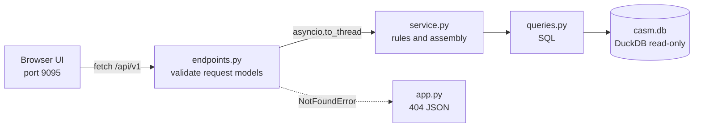

# API and UI

> Index: [README.md](../../README.md) · Database: [Database schema](3_1-database-schema.md) · Stack and setup: [Tech stack](3_2-tech-stack.md)

A read-only JSON API over `casm.db` and a static web UI that follows the design prototype in `.prototype/`.
Both start from `src/main.py`: the API on port 9099, then the UI on port 9095. Launching first stops any copy
already running on those ports.

## 1. Purpose

Show the data the migrations load, the way a user of a security master would meet it: look up an instrument by
any identifier, see what it is built on (its underlying security), inspect its issuer, listings and sources,
browse the reference sets, and read the architecture wiki. The API is the only reader of the database; the UI
only calls the API.

## 2. Key files

| Path | Role |
|---|---|
| `src/casm/api/app.py` | `create_app`: rebuilds the database in the startup lifespan, opens it read-only, adds CORS, error mapping, health, the `/` redirect to `/docs` |
| `src/casm/api/errors.py` | `NotFoundError`, mapped to a 404 JSON body by the app |
| `src/casm/api/logging_config.py` | `configure_logging`: the `casm` logger to the console and a rotating file, with the request id on every line |
| `src/casm/api/request_logging.py` | `RequestLoggingMiddleware`: request id, one line per request, JSON 500 for an unhandled error |
| `src/casm/api/utils/` | `database_utils` (async cursor dependency, row helpers), `sql_utils` (LIKE escaping), `json_utils` (Decimal and date to JSON), `file_utils` (SHA-256) |
| `src/casm/api/v1/models.py` | Pydantic request models: `SecuritySearch`, `IssuerSearch`, `ExceptionSearch`, `VenueSearch` (enumerated scopes and sorts, length limits, unknown parameters rejected) |
| `src/casm/api/v1/<section>/endpoints.py` | HTTP only: bind and validate parameters, call the service in a thread |
| `src/casm/api/v1/<section>/service.py` | Logic (securities and issuers, reference venues and sets, wiki) |
| `src/casm/api/v1/<section>/queries.py` | SQL only; returns rows |
| `src/casm/ports.py` | Finds and stops whatever listens on a port, so a launch replaces a previous run |
| `src/casm/ui/server.py` | Serves `src/casm/ui/` and a generated `/config.js` carrying the API address |
| `src/casm/ui/js/` | `main.js` router, `securities.js`, `reference.js`, `wiki.js`, shared `util.js`, `api.js` |

## 3. Layering

An endpoint never contains SQL or business rules; a query never decides anything. Request models reject bad
input before any query runs (HTTP 422), user text is bound as a parameter and LIKE wildcards are escaped.

## 4. Endpoints (`/api/v1`)

**Nothing is paged.** Every list endpoint returns all matching rows, with `total` equal to the number of rows.
A `limit` or `offset` parameter is rejected with 422.

| Section | Route | Returns |
|---|---|---|
| Securities | `GET /securities` | Every instrument (search `q`, `scope`, `product_code`, `mic`, `sort`, `direction`) with its identifiers (CUSIP, FIGI, composite FIGI, Bloomberg ticker, issuer CIK), primary listing, issuer and underlying security; the total, the detected identifier type and a note |
| | `GET /securities/filters` | Product-code and venue facets with counts, and the totals |
| | `GET /securities/{id}` | One instrument: taxonomy, issuer, identifiers, listings, terms, underlying, governance (attributes not held, and the integrity rules it satisfies), lineage; 404 if unknown |
| | `GET /issuers`, `/issuers/{id}` | Every issuer (search `q`, `sort`, `direction`) with its instrument count; one issuer with its instruments; 404 if unknown |
| | `GET /exceptions` | The exception queue with reasons and per-reason counts (filter `reason`) |
| Reference | `GET /reference/sets` | The five reference sets with counts, badges and pinned source file and SHA-256 |
| | `GET /reference/venues`, `/venues/{mic}` | The whole ISO 10383 registry (2,883 venues) by default, or only the venues loaded into CASM with `loaded=true`; one venue with usage and every instrument listed on it |
| | `GET /reference/gics` | The GICS hierarchy at all four levels, 262 nodes in code order (11 sectors, 24 industry groups, 69 industries, 158 sub-industries), each with its level, code, name, parent and child count; sub-industries carry their definition |
| | `GET /reference/taxonomy`, `/countries`, `/isda-equity` | The static sets; each taxonomy row has the product code, asset class code and name, base product code and name, description and source |
| | `GET /reference/taxonomy/{code}/instruments`, `/countries/{alpha2}/issuers` | Related rows; 404 if the code or country is unknown |
| Wiki | `GET /wiki`, `/wiki/{page_id}` | Pages in reading order (`index` is `README.md`, then the numbered pages); one page's markdown without front matter |
| System | `GET /api/health` | Status, build time, migrations applied |

Search scopes `isin` and `sedol` always return no rows with a note, because no source filled those
identifiers. Numbers are JSON numbers, dates ISO text.

## 5. The web UI

Every grid shows all its rows, with grid lines, a pinned header, 36px rows and a count at the bottom; each screen
fills the window height and the grid and inspector scroll inside it.

| Tab | Contents |
|---|---|
| **Securities** | Views **Instruments** (search with identifier detection and scope chips, asset-class and venue filters; columns for name, asset class, issuer, underlying, ticker, Bloomberg ticker, venue, CUSIP, FIGI, composite FIGI, issuer CIK, venue confidence), **Issuers** (with instrument counts) and **Exception queue**. The inspector has Details, Governance (attributes not held and why) and Lineage |
| **Reference Data** | Rail of the five sets with pinned-file status. Venues open on the full ISO 10383 registry (a filter narrows to the 13 loaded); GICS shows all four levels in one indented grid with a level filter; Taxonomy, Countries and ISDA follow. The inspector shows details, related rows and lineage |
| **Wiki** | These pages in reading order, rendered from markdown, with Mermaid diagrams and working links between pages |

**Underlying navigation.** In an instrument's Details the underlying security is a link that extends a breadcrumb
at the top of the inspector (earlier items shortened to 10 characters, the current one in full). Picking a grid
row starts a new trail. An issuer opens in the Issuers view; an issuer's instrument opens in Instruments.

Only data that exists is shown: no ISIN, SEDOL or currency column, because no source gave them; Governance lists
those gaps.

## 6. Logging

The `casm` logger (configured in `src/main.py`) writes to the console and a rotating file `logs/casm-api.log`
(5 MB, 3 backups, not committed). Flags: `--log-level` (default `INFO`), `--no-log-file`. uvicorn's access log
is off because the middleware logs every request.

Lines are `time level logger [request id] message`. The request id is the caller's `X-Request-ID` (cut to 64
characters) or generated, returned in the response header, carried into worker threads, and included in the
JSON of an unhandled-error 500 (`{"detail": "Internal server error", "request_id": ...}`, no internals).

| Level | Logged |
|---|---|
| INFO | Startup and shutdown, migrations and timing, one line per successful request, a missing record |
| WARNING | A 4xx request |
| ERROR | A 5xx with traceback; an instrument without an issuer row (broken integrity rule) |
| DEBUG | Each search with parameters and row count; every SQL query with row count and duration |

## 7. Tests and validation

- `tests/api/` mirrors the API: utilities, request models, each section's service and queries on the real seeded
  database (398 instruments, 213 issuers, 22 queued rows), every route over HTTP including 404, 422 and rejected
  paging parameters, CORS, the startup rebuild, wiki path traversal, and logging (format, request id, levels,
  JSON 500).
- `tests/ui/test_server.py` covers the static server and `config.js`; `tests/test_ports.py` the port stop.
- `.claude/skills/validate-ui` launches the app, drives Chrome over the DevTools Protocol, compares each screen
  with the data and writes `docs/validation/ui-validation-report.md` with screenshots.

## 8. Known gaps

- Read-only: no writes, authentication, rate limiting or caching.
- The UI has no unit tests of its own; the browser validation script covers it.
- The API returns plain dictionaries, not response models, so the OpenAPI schema describes requests but not
  response bodies.
- Unpaged grids render every row in the page (2,883 for the venue registry, 262 GICS nodes); this suits the
  prototype's data volume, not a large master.
- Logs are plain text lines, not JSON, and there is no log shipping or metrics.
- DuckDB is synchronous, so each request holds a worker thread while it queries.
- A security's "parent" (the derivatives that name it as their underlying) is not shown; only the underlying
  direction is navigable.
